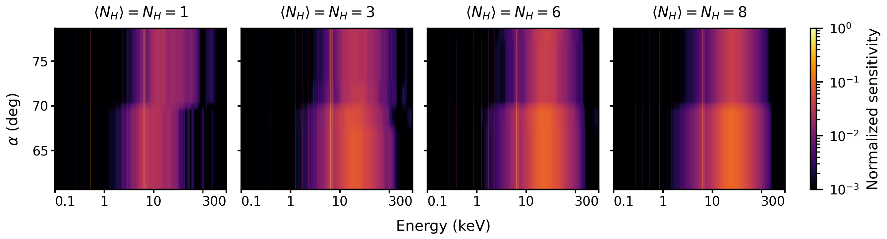
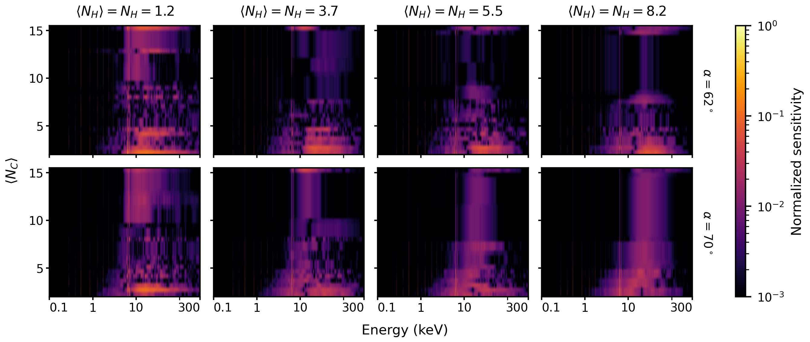
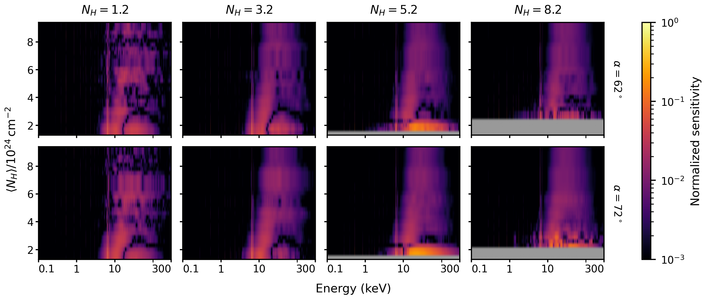
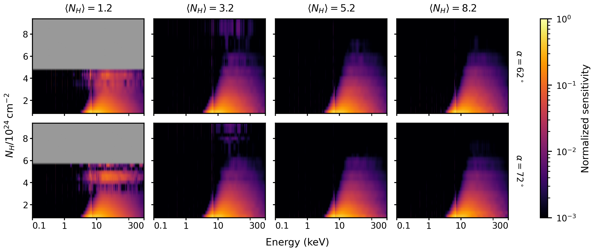
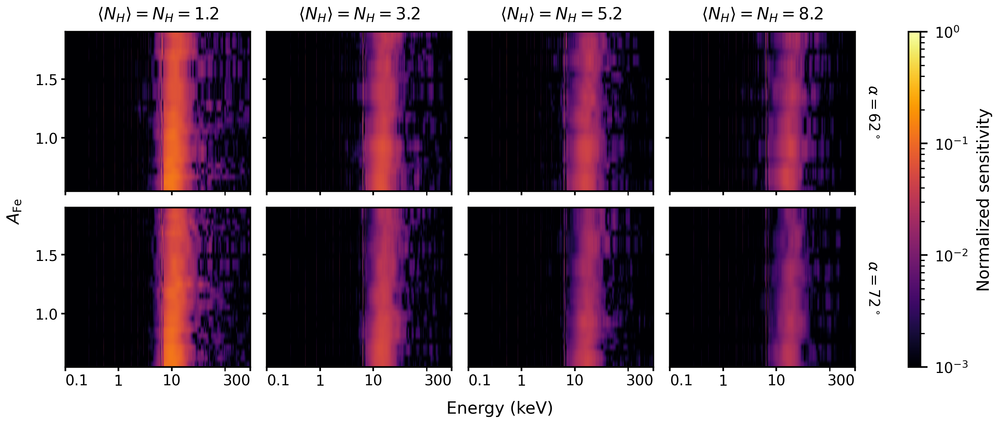

# Sensitivity maps

These maps show how strongly each part of the TORITO spectrum responds to each of the five
model parameters, over the parameter space covered by the interpolation grid. They extend
Appendix B of the paper (Melazzini & Sazonov), which shows only the map for the iron
abundance.

## What the maps show

The local sensitivity of the spectrum $F_E$ to the $k$-th parameter $\xi_k$, at a point
$\boldsymbol{\xi}$ of the parameter space, is the central difference

$$
S_k(E,\boldsymbol{\xi}) \approx \frac{F_E(E,\boldsymbol{\xi}+\Delta\xi_k\hat{e}_k) - F_E(E,\boldsymbol{\xi}-\Delta\xi_k\hat{e}_k)}{2\Delta\xi_k},
$$

where $\Delta\xi_k$ is a small step along that parameter and $\hat{e}_k$ is the
corresponding unit vector. Each map arranges $|S_k|$ as a matrix, with energy on the
horizontal axis and the value of the parameter on the vertical one, so that the spectral
regions where the parameter has the strongest influence stand out. The maps are useful for
checking the physical behaviour of the model and for seeing which spectral features
constrain each parameter in a fit.

Conventions, common to all maps:

- All panels of a figure share one logarithmic colour scale and show $|S_k|$ normalized
  to its maximum over the whole figure.
- Grey marks parameter values not covered by the grid.
- Column densities $N_\mathrm{H}$ (line of sight) and $\langle N_\mathrm{H}\rangle$
  (torus average) are in units of $10^{24}\,\mathrm{cm^{-2}}$; $\langle N_\mathrm{c}\rangle$
  is the average number of clouds along the line of sight, $\alpha$ the viewing angle and
  $A_\mathrm{Fe}$ the iron abundance relative to solar.

A weak local sensitivity does not by itself mean that a parameter is poorly recovered in a
fit; the recovery tests are in Section 6 of the paper.

## Viewing angle $\alpha$

*Local sensitivity of the spectrum to the viewing angle, $|\partial F_E/\partial\alpha|$.
Panels differ in the line-of-sight and average torus column densities, here equal to each
other, with $\langle N_\mathrm{c}\rangle=3$ and $A_\mathrm{Fe}=1$ throughout.*

The response to the viewing angle decreases toward equatorial directions when the column
density is large. In the Compton-thick regime, photons escaping near the equatorial plane
typically undergo multiple scatterings and absorption-reprocessing events before leaving
the torus, so the emergent spectrum is an average over many photon paths and depends only
weakly on the exact viewing direction.

The maps also behave differently at relatively low column densities, around
$N_\mathrm{H}\approx\langle N_\mathrm{H}\rangle\sim10^{24}\,\mathrm{cm^{-2}}$, where the
sensitivity to $\alpha$ is small and nearly uniform over the whole range of the angle. Near
this transition between the Compton-thin and Compton-thick regimes, photons escape after
only a few interactions, so the spectra seen from different directions remain much alike
and the viewing angle is intrinsically hard to constrain from the spectrum alone.

## Average number of clouds $\langle N_\mathrm{c}\rangle$

*Local sensitivity of the spectrum to the average number of clouds along the line of
sight, $|\partial F_E/\partial\langle N_\mathrm{c}\rangle|$. Columns are the column
densities, here equal to each other; rows are the two viewing angles. $A_\mathrm{Fe}=1$
throughout.*

The maps show the same equatorial decline at large column densities, for the same reason:
the emergent spectrum averages over many photon paths and so depends only weakly on the
precise cloud number, the residual variations becoming comparable to the noise level of
the interpolation grid.

Overall, the spectrum responds only modestly to $\langle N_\mathrm{c}\rangle$. The
response is concentrated between about 5 and 100 keV, in the Compton hump, and is largest
for the clumpiest tori ($\langle N_\mathrm{c}\rangle\lesssim4$), becoming two to three
times weaker at larger cloud numbers. This is consistent with
$\langle N_\mathrm{c}\rangle$ being the least precisely recovered parameter of the model.

## Average torus column density $\langle N_\mathrm{H}\rangle$

*Local sensitivity of the spectrum to the average torus column density,
$|\partial F_E/\partial\langle N_\mathrm{H}\rangle|$. Columns are the line-of-sight column
density $N_\mathrm{H}$; rows are the two viewing angles. $\langle N_\mathrm{c}\rangle=3$
and $A_\mathrm{Fe}=1$ throughout.*

The sensitivity to $\langle N_\mathrm{H}\rangle$ is slightly stronger near equatorial
viewing directions than at higher latitudes. Close to the equatorial plane the transmitted
component becomes less important and the reflected component, which depends strongly on
the column density, dominates the emergent spectrum, so small changes in
$\langle N_\mathrm{H}\rangle$ produce more noticeable variations in the reflected features.
Low values of $\langle N_\mathrm{H}\rangle$ are also generally easier to constrain than high
ones: in the Compton-thick regime, small perturbations produce only modest changes in the
spectrum, which can become comparable to the noise level of the grid.

## Line-of-sight column density $N_\mathrm{H}$

*Local sensitivity of the spectrum to the line-of-sight column density,
$|\partial F_E/\partial N_\mathrm{H}|$. Columns are the average torus column density
$\langle N_\mathrm{H}\rangle$; rows are the two viewing angles.
$\langle N_\mathrm{c}\rangle=3$ and $A_\mathrm{Fe}=1$ throughout.*

The sensitivity to $N_\mathrm{H}$ likewise decreases as $N_\mathrm{H}$ grows: once the
transmitted component is negligible and reflection dominates, a small perturbation of
$N_\mathrm{H}$ changes the spectrum by no more than the noise level of the grid.

## Iron abundance $A_\mathrm{Fe}$

*Local sensitivity of the spectrum to the iron abundance,
$|\partial F_E/\partial A_\mathrm{Fe}|$. Columns are the column densities, here equal to
each other; rows are the two viewing angles. $\langle N_\mathrm{c}\rangle=3$ throughout.*

The sensitivity to the iron abundance is generally stronger than for the other parameters
across the whole grid, and is particularly pronounced around the Fe K edge and the Compton
reflection hump. This reflects the strong influence of iron on the Fe Kα emission line,
the Fe K absorption edge and the reflection hump, characteristic features of the X-ray
spectra of obscured AGN, and it holds across a wide range of torus configurations.
